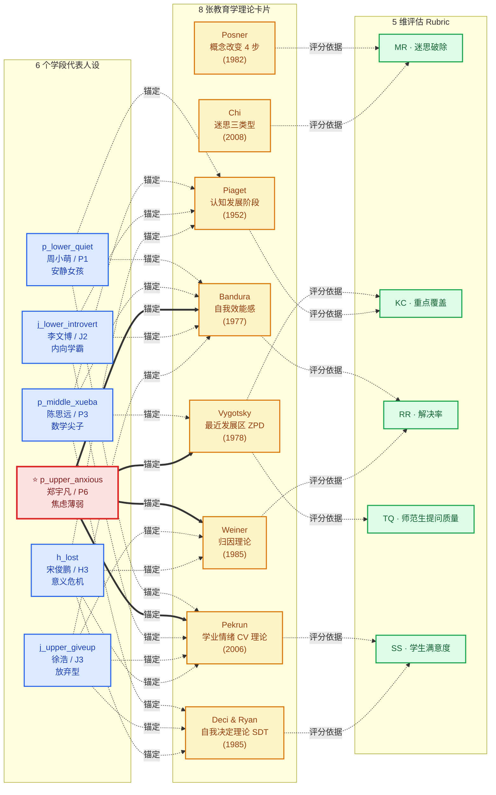
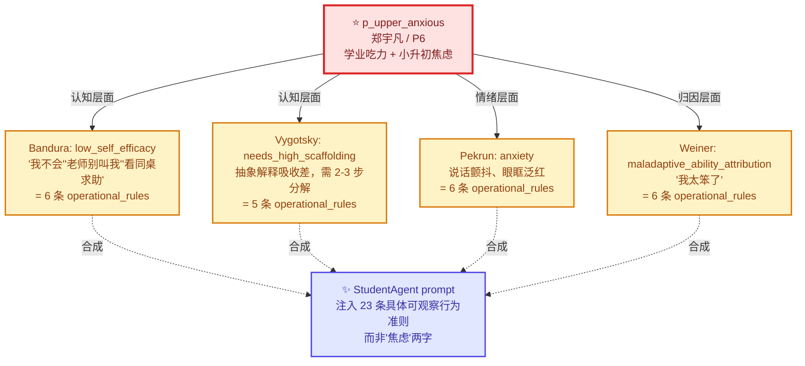
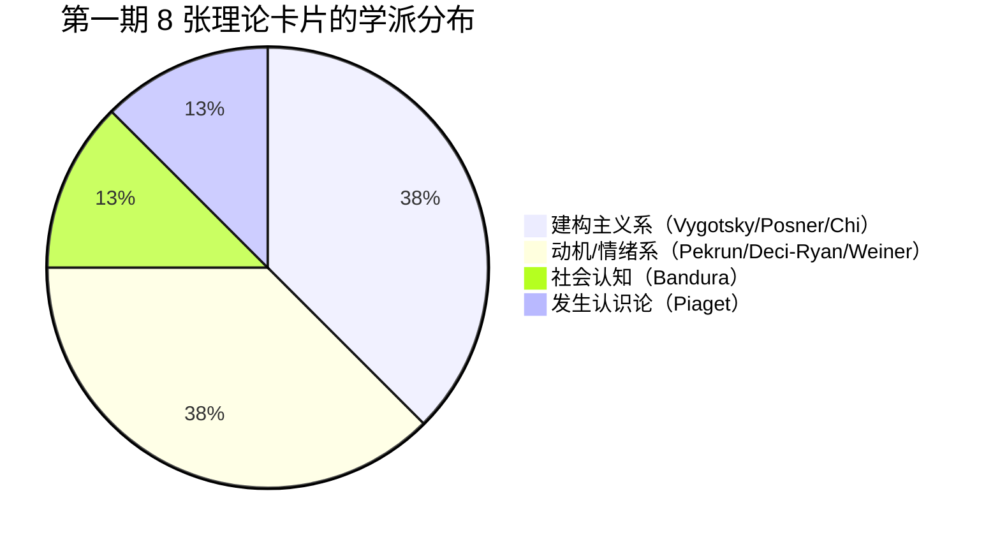

# EchoClass 教育学知识库关系图

> **状态**：M3 第一期 · 答辩主图 · 2026-04-27
> **作者**：C-Prod
> **配套文档**：`docs/edu_kb_design.md`（设计基线）/ `docs/eval_rubric_draft.md`（Rubric 草案）

---

## 0. 阅读指引

本图是答辩 5 分钟版本的主视觉。建议按以下顺序看：

1. **先看左中右三栏的标题**：左 = 教育学理论（8 张）、中 = 虚拟学生人设（6 个代表）、右 = 评估 Rubric 维度（5 个）
2. **再看边的颜色与语义**：实线 = "锚定"（人设引用理论 trait）；虚线 = "评分依据"（Rubric 维度引用理论操作化）
3. **最后看 anxious persona 的高亮路径**：4 条锚点同时连到 4 张卡片，是 EchoClass 与"形容词式 prompt"产品的差异化典型例

---

## 1. 全景关系图

---

## 2. 边的语义对照表

| 边形态 | 语义 | 数据载体 |
|---|---|---|
| **实线粗边** `==锚定==>` | POC 已实证的锚点 | `p_upper_anxious.theory_anchors` 4 条（含 POC 验证两条 + 本期扩充两条） |
| **虚线** `-.锚定.->` | 本期新增的 5 个 persona 锚点 | `data/personas/<persona>.json` 中 `theory_anchors` 字段 |
| **虚线** `-. 评分依据 .->` | Rubric 维度引用的理论操作化（M3 第二期落地） | `docs/edu_kb_design.md` §5 + `docs/eval_rubric_draft.md` v0.5 |

---

## 3. 重点关系：anxious persona 的"四锚点"案例

`p_upper_anxious`（郑宇凡）是 EchoClass 与同类产品差异化的典型例子。同一个人设同时被 **4 张教育学理论卡片**锚定，4 套 `operational_rules` 协同注入到 `StudentAgent` 的 prompt：

> **关键论证**：传统的形容词式 prompt（"焦虑、害羞、害怕考试"）只会得到风格化的台词；EchoClass 的多维理论锚点把"焦虑"这一笼统印象拆解为**认知 + 情绪 + 归因**三个独立维度的 23 条可观察行为，由不同学派的原典背书——这是答辩时可以掷地有声讲出来的科学性故事。

---

## 4. 学派分布

第一期覆盖了**「认知」「情绪」「动机」「概念改变」**四个核心维度，足以撑起一个学生人设的多维侧写。第二期补充**「评估能力」**（Bloom 修订版）与**「学习风格」**（Hattie 可见学习 / Gardner 多元智能）维度。

---

## 5. 后续路线

- **第二期补图**：把 Bloom + Hattie 加入主图（连到 TQ + SS），形成 10 张理论卡片的稳定盘
- **进化层补图**：增加 `trait_drift_detector → review queue → CI rebuild` 子图，演示进化 pipeline 的回路
- **持续维护**：每新增一个 persona anchor 或 Rubric ↔ theory 引用，本图同步更新（建议作为 PR checklist 一项）

---

## 6. 渲染说明

- 本图采用 [Mermaid](https://mermaid.js.org/) 语法，GitHub 与 VSCode + Markdown Preview Mermaid Support 插件均可直接渲染
- 答辩用导出建议：`mmdc -i edu_kb_theory_map.md -o edu_kb_theory_map.png -t default -b transparent`
- 颜色方案：理论 = 琥珀色 / 人设 = 蓝色 / Rubric = 绿色 / POC 高亮 anxious = 红色（与 EchoClass 演示文档配色保持一致）
